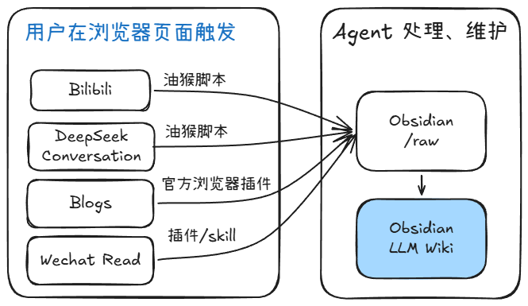

# Obsidian Manager

AI 驱动的个人知识库工作流。从 B站、DeepSeek、网页、微信读书等多种来源采集内容，Agent 自动摘要、提取概念、构建可检索、可链接的知识图谱。



> **关于本项目：** 脚本和工具链由 Coding Agent 协助搭建；LLM 管理知识库的整体思路借鉴了 [Karpathy LLM Wiki](https://gist.github.com/karpathy/442a6bf555914893e9891c11519de94f) 模式，目前仍在与用户磨合中持续调整。

## 架构

```
┌─────────────────────────────────────────────────────┐
│                    采集层 (Tampermonkey)              │
│  bili-clipper.user.js    deepseek-export.user.js    │
│         ↓                        ↓                   │
│    kb/raw/bilibili/        kb/raw/deepseek/          │
└─────────────────────┬───────────────────────────────┘
                      │ git status 检测 delta
                      ▼
┌─────────────────────────────────────────────────────┐
│                  处理层 (@clipper agent)              │
│  Step 1: 写来源摘要 → sources/summary-{slug}.md     │
│  Step 2: 写/更新概念 → concepts/{概念}.md            │
│  Step 3: 建立互链                                     │
│  Step 4: 更新索引 → index.md                          │
│  Step 5: 追加日志 → log.md                            │
│  Step 6: git commit                                  │
└─────────────────────┬───────────────────────────────┘
                      ▼
┌─────────────────────────────────────────────────────┐
│                    知识库 (Obsidian vault)            │
│  kb/wiki/concepts/    概念笔记（跨来源知识节点）      │
│  kb/wiki/sources/     来源摘要 + 归档                 │
│  kb/wiki/index.md     总目录                          │
│  kb/wiki/log.md       操作日志                        │
└─────────────────────────────────────────────────────┘
```

## 快速开始

### 1. 安装依赖

| 依赖 | 说明 |
|------|------|
| [Obsidian](https://obsidian.md) | 打开你的 vault |
| [Obsidian Local REST API](https://github.com/coddingtonbear/obsidian-local-rest-api) | 端口 27124，HTTPS |
| [Tampermonkey](https://www.tampermonkey.net) | 浏览器扩展 |
| [Opencode](https://opencode.ai) | TUI 或 Obsidian 插件 |

### 2. 配置

```bash
# 复制配置模板
cp .env.example .env
cp config.example.json config.json

# 编辑 .env，填入你的 vault 路径
# 编辑 config.json，填入你的 B站 Cookie 和 vault 路径
```

### 3. 安装油猴脚本

在 Tampermonkey 中导入：
- `scripts/bili-clipper.user.js` — B站剪藏
- `scripts/deepseek-export.user.js` — DeepSeek 对话导出

### 4. 初始化 KB

```bash
cd $OBSIDIAN_VAULT_PATH/kb
git init
git add .
git commit -m "初始提交"
```

## 使用

### B站剪藏

1. 打开 B站视频页
2. 点击页面右下角 **⬇ KB** 按钮
3. 脚本自动抓取：视频信息 → 字幕 → 评论
4. 文件保存到 `kb/raw/bilibili/{标题}_{BVID}.md`
5. 对 AI 说 "ingest"，Agent 自动处理

### DeepSeek 导出

1. 打开 DeepSeek 对话页
2. 点击页面右下角 **📥 导出** 按钮
3. 文件保存到 `kb/raw/deepseek/{标题}.md`
4. 对 AI 说 "ingest"

### 知识库查询

直接对话提问，AI 自动查询 `kb/wiki/` 综合回答。好的分析可以归档为 `archive-{slug}.md`。

### 健康检查

对 AI 说 "lint" 或 "检查 wiki"，自动扫描并修复问题。

## 项目结构

```
obsidian_manager/
├── .opencode/
│   ├── agents/
│   │   ├── clipper.md          # KB 摄取工作流
│   │   └── reading.md          # 读书陪读工作流
│   └── skills/
│       ├── wiki-lint/          # Wiki 健康检查
│       ├── wiki-query/         # Wiki 查询
│       ├── cross-linker/       # 自动补链
│       └── llm-wiki/           # LLM Wiki 模式说明
├── scripts/
│   ├── bili-clipper.user.js    # B站剪藏（油猴）
│   ├── deepseek-export.user.js # DeepSeek 导出（油猴）
│   ├── bili-api.ps1            # B站 API 模块（PowerShell）
│   ├── bili-fetch.ps1          # B站全量抓取（PowerShell）
│   └── deepseek-fetch.py       # DeepSeek 导出（Python/Playwright）
├── templates/                  # 笔记模板
├── docs/                       # 项目文档
├── .env.example                # 环境变量模板
├── config.example.json         # 配置模板
├── AGENTS.md                   # Agent 技术细节
└── README.md
```

## 工作流

| 操作 | 触发方式 | 说明 |
|------|---------|------|
| **Ingest** | `raw/` 有新文件 + 说 "ingest" | 读取 → 摘要 → 概念 → 互链 → 索引 → 日志 → commit |
| **Query** | 提问 | 读索引定位 → 读相关页 → 综合回答 |
| **Lint** | 说 "lint" | 确定性问题自动修，启发式问题报告 |
| **Crosslink** | 说 "补链接" | 扫描未加链的概念名，自动插入 wikilink |

## KB 目录结构

```
$OBSIDIAN_VAULT_PATH/kb/
├── raw/                        # 原始材料（永不修改）
│   ├── bilibili/               # B站剪藏
│   ├── deepseek/               # DeepSeek 对话导出
│   └── web/                    # 网页剪藏
├── wiki/                       # Agent 维护的知识库
│   ├── index.md                # 总目录
│   ├── log.md                  # 操作日志
│   ├── concepts/               # 概念笔记
│   └── sources/                # 来源摘要 + 归档
└── .gitignore
```

## 概念命名规范

Agent 创建概念页时遵循：
1. **精确匹配粒度** — 对话讨论"Agent 架构"→ 概念叫 `Agent 架构`，不叫 `AI Agent`
2. **避免过度泛化** — 石棉管控法规 → `石棉职业健康`，不叫 `中国法规`
3. **检查已有概念** — 新建前先检查是否可复用
4. **断链检查** — wikilink 必须指向已存在的页面

## License

[MIT](LICENSE)
